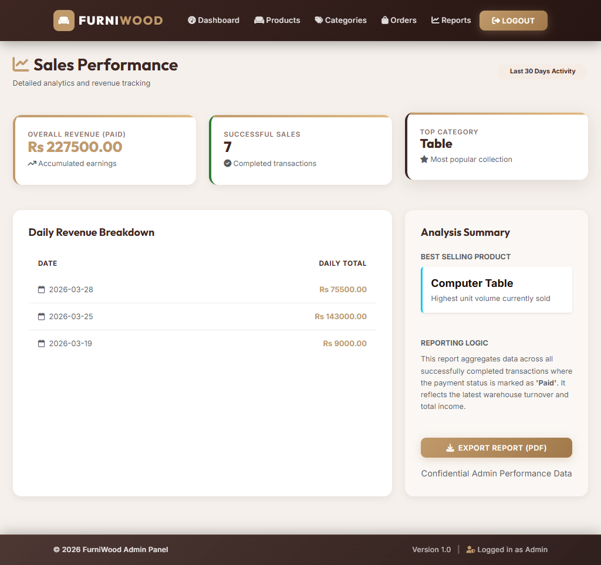
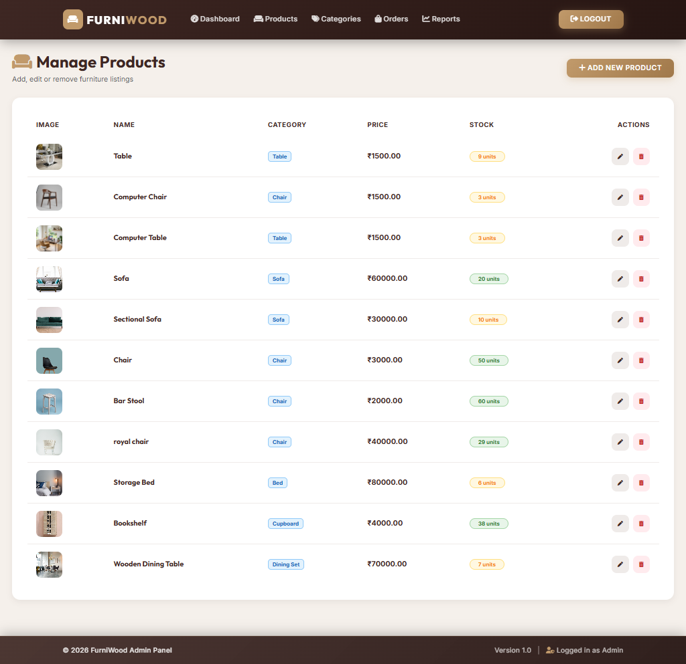
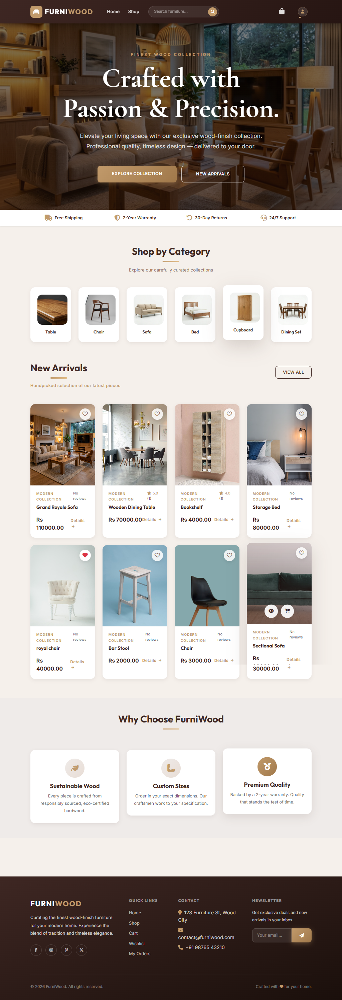
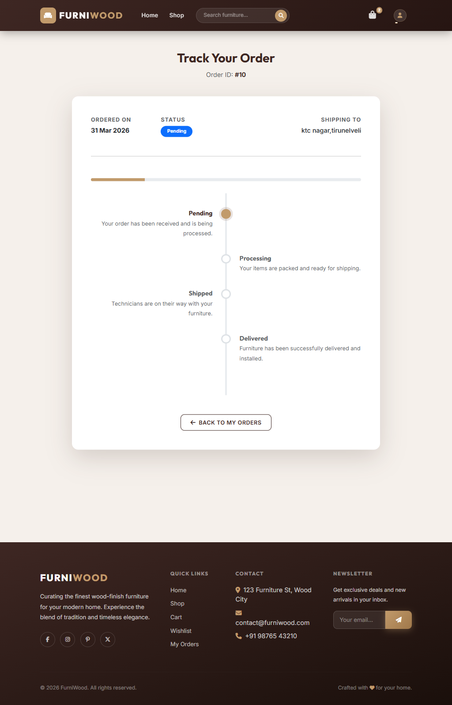

# 🪑 FurniWood - Premium Furniture E-commerce Platform

**FurniWood** is a sophisticated, full-stack e-commerce application tailored for high-end furniture retail. Built with a robust **Python Flask** backend and a premium, minimalist frontend, it delivers a seamless shopping experience for customers and a powerful management suite for administrators.

---

## 🌟 Key Features

### 🛒 Customer Experience
- **Premium Minimalist UI:** A clean, aesthetic design using **Bootstrap 5** and custom CSS to showcase products.
- **Advanced Search & Filtering:** Find products quickly by name, category, price range, or stock availability.
- **Product Image Zoom & Gallery:** High-detail product views to inspect textures and materials.
- **Related Products:** Intelligent suggestions ("You May Also Like") based on product categories.
- **Verified Reviews:** A high-trust feedback system that restricts reviews to purchase-verified customers (Orders marked "Delivered").
- **Real-time Order Tracking:** A visual status timeline (Pending → Shipped → Delivered) for all active purchases.
- **Wishlist & Cart:** Seamless persistence of favorite items and a streamlined checkout flow.
- **Newsletter Subscription:** Integrated system for marketing and customer engagement.

### 🛠️ Admin Capabilities
- **Sales Analytics Dashboard:** Real-time reporting on revenue, total orders, and growth metrics.
- **Inventory Management:** Complete CRUD operations for products and categories with **automated Low Stock Alerts**.
- **Order Command Center:** Monitor and update delivery statuses (Processing, Shipped, Delivered) in real-time.
- **Customer Insights:** Comprehensive overview of registered users and their transaction history.
- **Performance Highlights:** Identify best-selling products and top-performing categories.

---

## 🚀 Tech Stack

- **Backend:** [Python 3.10+](https://www.python.org/) / [Flask 3.0.0](https://flask.palletsprojects.com/)
- **Database:** [MySQL](https://www.mysql.com/) (Relational schema with 14 tables for complex data integrity)
- **Frontend:** HTML5, Modern CSS3, Vanilla JavaScript, [Bootstrap 5](https://getbootstrap.com/)
- **Security:** [Bcrypt](https://pypi.org/project/bcrypt/) for password hashing and secure Session Management.
- **Payments:** Integrated **Razorpay** simulation for secure online transactions.
- **Animations:** [AOS](https://michalsnik.github.io/aos/) (Animate On Scroll) for a premium, interactive feel.

---

## 📊 Database Architecture

The project uses a structured relational database (`furniture_shop`) with the following core entities:
*   **Users:** Manages customer profiles and authentication.
*   **Products & Categories:** High-performance lookup for inventory and catalog logic.
*   **Orders & Order Items:** Tracks complex transaction histories and line-item details.
*   **Reviews:** Stores verified customer feedback and ratings.
*   **Wishlist & Cart:** Manages user-specific preferences and pending purchases.
*   **Delivery Status:** Specialized lookup for granular order tracking.

---

## 📂 Project Structure

```text
├── app.py                # Main application entry point & context processors
├── models/
│   └── database.py       # DB connection pool and helper functions
├── routes/
│   ├── admin_routes.py   # Dashboard, inventory, and order management
│   ├── auth_routes.py    # Login, registration, and logout
│   ├── cart_routes.py    # Cart logic, stock validation, and checkout
│   ├── review_routes.py  # Verified feedback submission logic
│   └── store_routes.py   # Homepage, shop filters, and order tracking
├── static/
│   ├── css/              # Custom design system and style tokens
│   ├── images/           # Product and category assets
│   └── js/               # Interactive UI components
├── templates/            # Jinja2 HTML templates
└── requirements.txt      # Project dependencies
```

---

## 🛠️ Installation & Setup

1. **Clone the repository:**
   ```bash
   git clone <repository-url>
   cd furniture.py
   ```

2. **Install dependencies:**
   ```bash
   pip install -r requirements.txt
   ```

3. **Database Configuration:**
   - Create a MySQL database named `furniture_shop`.
   - Update connection details (host, user, password) in `models/database.py`.
   - Import the provided `furnituredb.sql` schema.

4. **Run the application:**
   ```bash
   python app.py
   ```
   *The store will be available at `http://127.0.0.1:5000`*

---

## 🎨 Design Philosophy
FurniWood follows a premium "Wood & Cream" aesthetic. It focuses on large whitespace, elegant typography (Inter/Roboto), and smooth micro-animations to create a high-end atmosphere that reflects the quality of fine furniture.

---
*Developed as a professional e-commerce demonstration for high-end furniture retail.*

## 📊 Admin Dashboard


## 📦 Admin Product Page


## 🏠 User Home Page


## 📦 Order Tracking


## 📸 More Screenshots

Additional screenshots are available in the `screenshots/` folder.git add .